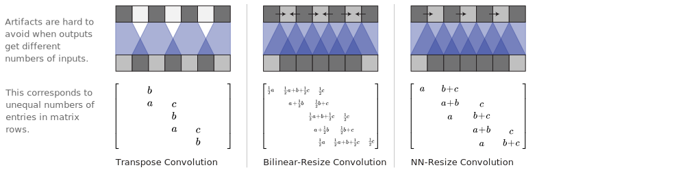

<link rel="stylesheet" type="text/css" href="assets/w_page.css">

<h1>{{ distill.title }}</h1>
{{> byline.html}}

When we look very closely at images generated by neural networks, we often see a strange checkerboard pattern of artifacts. It's more obvious in some cases than others, but a large fraction of recent models exhibit this behavior.

{{> assets/samples.html}}

Mysteriously, the checkerboard pattern tends to be most prominent in images with strong colors.
What's going on? Do neural networks hate bright colors? The actual cause of these artifacts is actually remarkably simple, as is a method for avoiding them.

---
## Deconvolution & Overlap

When we have neural networks generate images, we often have them build them up
from low resolution, high-level descriptions.
This allows the network to describe the rough image and then fill in the details.

In order to do this, we need some way to go from a lower resolution image to a higher one.
We generally do this with the *deconvolution* (or transposed convolution) operation.
Roughly, deconvolution layers allows the model to use every point
in the small image to "paint" a square in the larger one.
(For more detailed discussion, see [Dumoulin & Visin, 2016](https://arxiv.org/pdf/1603.07285v1.pdf) and [Shi, et al., 2016](https://arxiv.org/pdf/1609.07009.pdf).)

Unfortunately, deconvolution can easily have uneven overlap,
putting more of the metaphorical paint in some places than others.
While the network could, in principle, carefully learn weights to avoid this
-- as we'll discuss in more detail later --
in practice neural networks struggle to avoid it completely.

{{> assets/deconv1d.html}}

In particular, deconvolution has uneven overlap when the kernel size (the output window size) is not divisible by the stride (the spacing between points on the top).

The overlap pattern also forms in two dimensions.
The uneven overlaps on the two axes multiply together,
creating a characteristic checkerboard-like pattern of varying magnitudes.

{{> assets/deconv2d.html}}

In fact, the uneven overlap tends to be more extreme in two dimensions!
Because the two patterns are multiplied together, the unevenness gets squared.
For example, in one dimension, a stride 2, size 3 deconvolution has some outputs with twice the number of inputs as others,
but in two dimensions this becomes a factor of four.

Now, neural nets typically use multiple layers of deconvolution when creating images,
iteratively building a larger image out of a series of lower resolution descriptions.
While it's possible for these stacked deconvolutions to cancel out artifacts,
they often compound, creating artifacts on a variety of scales.

{{> assets/deconv1d_multi.html}}

Stride 1 deconvolutions --
which we often see as the last layer in successful models (eg. <a href="https://arxiv.org/pdf/1606.03498v1.pdf">Salimans et al., 2016</a>)
-- are quite effective dampening artifacts.
 They can remove artifacts of frequencies
that divide their size, and reduce others artifacts of frequency less than their
size. However, artifacts can still leak through, as seen in many recent models.

In addition to the high frequency checkerboard-like artifacts we observed above,
early deconvolutions can create lower-frequency artifacts,
which we'll explore in more detail later.

These artifacts tend to be most prominent when outputting unusual colors.
Since neural network layers typically have a bias
(a learned value added to the output) it's easy to output the average color.
The further a color, like bright red, is away from the average color,
the more deconvolution needs to contribute to push it there.

-----
## Overlap & Learning

Thinking about things in terms of uneven overlap is -- while a useful framing --
kind of simplistic. For better or worse, our models learn weights for their deconvolutions.

In theory, they could learn to carefully write to unevenly overlapping squares so that the output
is evenly balanced.
In practice, however, neural networks struggle to learn to not create these patterns.
This is kind of surprising to us:
barring extreme regularization, it seems like they should be able to learn this.

In fact, not only do models with uneven overlap not learn to avoid this,
but models with even overlap often learn kernels that cause similar artifacts!
The artifacts seem milder, and have a different pattern, but they're present.
(See [Dumoulin, et al., 2016](https://arxiv.org/pdf/1606.00704v1.pdf),
which uses stride 2 size 4 deconvolutions, as an example.)

There's probably a lot of factors at play here.
One issue, in the case of GANs, may be with the discriminator and its gradients, which we'll discuss more later.
But a big part of the problem seems to be deconvolution.
At best, deconvolution is fragile because it is very easily represents artifact creating functions, even when the size is carefully chosen.
At worst, creating artifacts is the default behavior of deconvolution.

Is there a different way to upsample that is more resistant to artifacts?

-----
## Better Upsampling

To avoid these artifacts, we'd like an alternative to regular deconvolution ("transposed convolution").
Unlike deconvolution, this approach to upsampling shouldn't have artifacts as its default behavior.
Ideally, it would go further, and be biased against such artifacts.

One approach is to make sure you use a kernel size that is divided by your stride.
This avoids the uneven overlap issue,
and you can speed up computation using the efficient sub-pixel convolution trick ([Shi, et al., 2016b](https://arxiv.org/pdf/1609.05158.pdf)).
However, while this helps, it is still easy for deconvolution to fall into artifacts.

Another approach is to separate out upsampling to a higher resolution from convolution to compute features.
For example, you might resize the image (using [nearest-neighbor interpolation](https://en.wikipedia.org/wiki/Nearest-neighbor_interpolation) or [bilinear interpolation](https://en.wikipedia.org/wiki/Bilinear_interpolation)) and then do a convolutional layer.
This seems like a natural approach, and roughly similar methods have seen success in the image super-resolution literature.

Both deconvolution and the different resize-convolution approaches are linear operations, and can be interpreted as matrices.
This a helpful way to see the differences between them.

<figure class="w-page-clip-left">

</figure>

Where deconvolution has a unique entries for each output window, resize-convolution is implicitly weight-tying in a way that discourages high frequency artifacts.

----
## Image Generation Results

Our experience has been that nearest-neighbor resize followed by a convolution works very well, in a wide variety of contexts.

One case where we've found this approach to help is Generative Adversarial Networks. Simply switching out the standard deconvolutional layers for nearest-neighbor resize followed by convolution causes artifacts of different frequencies to disappear.

{{> assets/deconv_fixes.html}}

We are convinced that this isn't GAN specific because we see these same artifacts in other kinds of models, and have found that they also go away when we switch to resize-convolution upsampling.

For a very different example, consider real-time artistic style transfer ([Johnson, et al., 2016](https://arxiv.org/pdf/1603.08155v1.pdf)) where a neural net is trained to accelerate artistic style transfer.
We've found these to be vulnerable to checkerboard artifacts (especially when the cost doesn't explicitly resist them).
However, switching deconvolutional layers for resize-convolution layers makes the artifacts disappear.

{{> assets/style_fix.html}}

Forthcoming papers from the Google Brain team will demonstrate the benefits of this technique
in more thorough experiments and state-of-the-art results.
(We chose to present this technique separately because we felt it merited more detailed discussion.)

<!--
Things Luke Vilnis suggested we look into:
* should we be calling it deconv?
* this paper argues for a different but related architecture http://128.84.21.199/pdf/1609.07009.pdf (seems like high-res literature already does something similar to what we are doing)
-->

-----
## Artifacts in Gradients

Whenever we compute the gradients of a convolutional layer,
we do deconvolution (transposed convolution) on the backward pass.
If the stride doesn't divide the kernel size,
we get checkerboard patterns in the gradient,
just as we do when we use deconvolution to generate images.

This means that some neurons will get many times the gradient of their neighbors, basically arbitrarily.
Similarly, the network will care much more about some pixels in the input than others, for no good reason.
This strange property is wide spread among modern vision models, and it suggests a number of questions.

* **Generative Adverserial Network**:
One thing you might wonder about is the artifacts in GAN produced images.
We've seen that standard deconvolution-based generators are biased towards creating them,
but could a bias in the discriminators makes it hard for them to catch these artifacts, or even encourage them?

* **Training Neural Networks**:
If some neurons get many times the gradient of others, does that present a challenge for training?
Is it an argument for optimizers like ADAM, which are invariant to the scale of the gradient different neurons get?

* **Feature Visualization**:
A major challenge for optimization-based feature visualization in vision models is that the gradient of the models we are visualizing seem to be dominated by high frequency components.
Successful visualizations need to somehow compensate for this.
There are a number of approaches, including jittering the image between steps, imposing a prior or constraint on the image, blurring the gradient, or just directly normalizing the frequencies.
However, one wonders if this high-frequency noise is just an artifact of strided convolutions, and the issue might just go away if we didn't use them.
**TODO: citations**
<!--  https://github.com/tensorflow/tensorflow/blob/master/tensorflow/examples/tutorials/deepdream/deepdream.ipynb -->

* **Adversarial counter-examples**:

---
## Conclusion

The standard approach of producing images with deconvolution -- despite its successes! -- has some very conceptually simple issues, that lead to artifacts in produced images.
Using a natural alternative without these issues causes the artifacts to go away.
(Analogous arguments suggest that standard strided convolutional layers may also have issues, although we're not aware of any actual problems arising from this.)

This seems like an exciting opportunity to us!
It suggests that there is low-hanging fruit to be found in carefully thinking through neural network architectures, even once where we seem to have clean working solutions.

In the mean time, we've provided an easy to use solution that improves the quality of many approaches to generating images with neural networks. We look forward to seeing what people do with it, and whether it helps in domains like audio where high frequency artifacts would be particularly problematic.

<!-- Appendix -->
<section class="appendix w-body">
  <h3>Acknowledgments</h3>
  
We are very grateful to Shan Carter for his wonderful improvements to the first interactive diagram, design advice, and editorial taste.

  
Thank you also to Luke Vilnis, Jon Shlens, Luke Metz, and Ben Poole for their feedback and encouragement.

  <h3 id="citation">Errors, Reuse, and Citation</h3>
  
If you see mistakes or want to suggest changes, please submit a pull request on <a href="{{{distill.github}}}">github</a>.
  
Diagrams and text are licensed under Creative Commons Attribution <a href="https://creativecommons.org/licenses/by/2.0/">CC-BY 2.0</a>, unless noted otherwise, with the source available on available on <a href="{{{distill.github}}}">github</a>. The figures that have been reused from other sources don't fall under this license and can be recognized by a note in their caption: "Figure from …".
  
For attribution in academic contexts, please cite this work as
  <pre class="citation">Augustus Odena, Vincent Dumoulin, & Chris Olah. "{{distill.title}}", Distill, {{distill.firstPublishedYear}}.</pre>
  
BibTeX citation
  {{=<% %>=}}
<pre class="citation">@misc{<%distill.slug%>,
  author = {<%distill.bibtexAuthors%>},
  title = {<%distill.title%>},
  year = {<%distill.firstPublishedYear%>},
  howpublished = {<%distill.url%>}
}</pre>

  <%={{ }}=%>
  <h3>References</h3>
  <ul class="references">
    <li></li>
  </ul>

</section>
